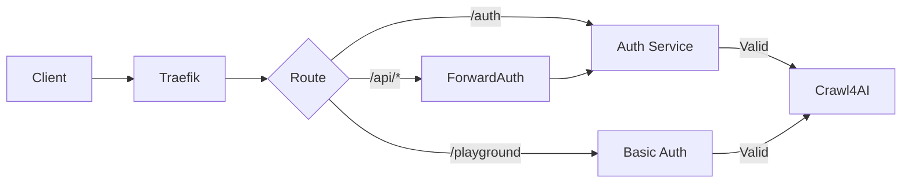

# Secure Crawl4AI Production Deployment for Dokploy

A production-ready, secure deployment of Crawl4AI optimized for Dokploy with Traefik integration, featuring API key authentication for API endpoints and basic authentication for the Playground interface.

## 🚀 Features

- **Secure API Authentication**: API key-based authentication for all API endpoints
- **Playground Protection**: Basic authentication for the web playground
- **Traefik Integration**: Native Dokploy/Traefik routing with automatic SSL
- **Rate Limiting**: Per-API-key rate limiting with Redis backend
- **Resource Management**: Configurable memory and CPU limits
- **Health Monitoring**: Built-in health checks and Prometheus metrics
- **LLM Support**: Support for multiple LLM providers
- **High Performance**: Redis caching and optimized browser pool management

## 📋 Prerequisites

- Dokploy instance with Traefik running
- Docker and Docker Compose
- Python 3.8+ (for setup scripts)
- Domain pointed to your server

## 🔧 Quick Start

### 1. Clone and Setup

```bash
# Clone the repository
git clone <your-repo>
cd crawl4ai-production

# Generate secure configuration
python scripts/generate_secrets.py
```

### 2. Configure LLM Providers

```bash
# Copy and edit LLM configuration
cp .llm.env.example .llm.env
nano .llm.env  # Add your API keys
```

### 3. Deploy to Dokploy

In Dokploy Dashboard:

1. Create a new **Docker Compose** project
2. Upload or paste the `docker-compose.yml` file
3. Add environment variables from `.env`
4. Set the domain in Dokploy settings
5. Deploy the project

### 4. Verify Deployment

```bash
# Test the deployment
python scripts/test_deployment.py your-domain.com
```

## 🔐 Security Architecture

### Authentication Flow



### Components

1. **Auth Service**: Standalone FastAPI service handling:
   - API key validation
   - Rate limiting
   - JWT token generation
   - Metrics collection

2. **Crawl4AI Service**: Modified with auth proxy:
   - Validates requests via auth service
   - Handles crawling operations
   - Manages browser pool

3. **Redis**: Shared backend for:
   - Rate limiting counters
   - Session management
   - Cache storage

## 📚 API Usage

### Using API Keys

```python
import httpx

API_KEY = "sk-prod-xxxxxxxxxxxxxxx"
BASE_URL = "https://crawl4ai.yourdomain.com"

headers = {"Authorization": f"Bearer {API_KEY}"}

# Basic crawl
response = httpx.post(
    f"{BASE_URL}/crawl",
    json={
        "urls": ["https://example.com"],
        "browser_config": {"type": "BrowserConfig", "params": {"headless": True}},
        "crawler_config": {"type": "CrawlerRunConfig", "params": {"cache_mode": "bypass"}}
    },
    headers=headers
)
```

### Available Endpoints

- `POST /crawl` - Crawl single or multiple URLs
- `POST /crawl/stream` - Stream crawl results
- `POST /screenshot` - Capture screenshots
- `POST /pdf` - Generate PDFs
- `POST /md` - Extract markdown
- `GET /llm/{url}` - LLM-based Q&A
- `GET /health` - Health check
- `GET /metrics` - Prometheus metrics

### Playground Access

Access the interactive playground at:
```
https://your-domain.com/playground
```

Use the admin credentials set during setup.

## 🔑 API Key Management

### Creating API Keys

Edit the `API_KEYS_CONFIG` in `.env`:

```json
{
  "prod-001": {
    "name": "Production Key",
    "key": "sk-prod-xxxxxxxx",
    "rate_limit": "1000/minute",
    "scopes": ["crawl", "screenshot", "pdf"],
    "enabled": true
  }
}
```

### Rate Limits

- Format: `{requests}/{period}`
- Periods: `second`, `minute`, `hour`, `day`
- Example: `100/minute`, `5000/hour`

### Scopes

- `crawl`: Basic crawling
- `screenshot`: Screenshot capture
- `pdf`: PDF generation
- `md`: Markdown extraction
- `llm`: LLM operations

## ⚙️ Configuration

### Resource Limits

Edit `.env`:

```bash
MEMORY_LIMIT=8G          # Container memory limit
CPU_LIMIT=4              # CPU cores
MAX_CONCURRENT_CRAWLS=10 # Concurrent crawl limit
```

### Browser Configuration

Edit `config/crawl4ai-config.yml`:

```yaml
crawler:
  pool:
    max_pages: 40         # Max browser instances
    idle_ttl_sec: 1800    # Idle browser timeout
  timeouts:
    page_load: 30.0       # Page load timeout
    request: 60.0         # Request timeout
```

## 📊 Monitoring

### Health Checks

```bash
# Check service health
curl https://your-domain.com/health

# Check auth service
curl https://your-domain.com/auth/health
```

### Metrics

Prometheus metrics available at:
```
https://your-domain.com/metrics
```

Key metrics:
- `auth_requests_total` - Authentication attempts
- `api_key_validations_total` - API key validations
- `rate_limit_hits_total` - Rate limit violations
- `auth_duration_seconds` - Auth request latency

### Logs

```bash
# View logs in Dokploy
docker-compose logs -f crawl4ai
docker-compose logs -f auth-service
docker-compose logs -f redis
```

## 🚨 Troubleshooting

### Common Issues

1. **Authentication Failures**
   - Verify API key format: `Bearer sk-xxx`
   - Check key exists in configuration
   - Ensure auth service is healthy

2. **Rate Limiting**
   - Check current limits in metrics
   - Adjust limits in API key config
   - Clear Redis if needed: `redis-cli FLUSHDB`

3. **Performance Issues**
   - Monitor memory usage
   - Check browser pool size
   - Review concurrent crawl limits

4. **SSL/Domain Issues**
   - Verify DNS configuration
   - Check Traefik certificates
   - Ensure domain matches configuration

## 🔄 Maintenance

### Updating API Keys

1. Edit `.env` file
2. Restart services:
   ```bash
   docker-compose restart auth-service
   ```

### Backup

```bash
# Backup configuration
tar -czf backup.tar.gz .env .llm.env config/

# Backup Redis data
docker exec redis redis-cli --rdb /data/backup.rdb
```

### Scaling

For high load, consider:
1. Increasing resource limits
2. Adding more replicas (requires Docker Swarm)
3. Using external Redis cluster
4. Load balancing across multiple instances

## 📝 Security Best Practices

1. **Rotate API Keys Regularly**
   ```bash
   python scripts/generate_secrets.py
   ```

2. **Monitor Access Logs**
   ```bash
   docker-compose logs auth-service | grep "401\|403\|429"
   ```

3. **Update Dependencies**
   ```bash
   docker-compose pull
   docker-compose up -d
   ```

4. **Restrict Network Access**
   - Use Dokploy's firewall rules
   - Limit access to specific IPs if possible

5. **Secure Storage**
   - Never commit `.env` files
   - Use secrets management for production
   - Encrypt backups

## 📚 Advanced Configuration

### Custom Authentication Provider

To integrate with external auth systems, modify `auth/auth_service.py`:

```python
async def validate_external_auth(token: str) -> Optional[Dict]:
    # Implement your auth logic
    pass
```

### Adding Custom Middleware

Edit `docker-compose.yml` to add Traefik middleware:

```yaml
labels:
  - "traefik.http.middlewares.custom.headers.customRequestHeaders.X-Custom=value"
```

### Performance Tuning

For optimal performance:

1. **Redis Optimization**:
   ```yaml
   command: redis-server --maxmemory 512mb --maxmemory-policy allkeys-lru
   ```

2. **Browser Pool**:
   ```yaml
   crawler:
     pool:
       max_pages: 100  # Increase for high load
   ```

3. **Connection Pooling**:
   ```yaml
   timeouts:
     stream_timeout: 600.0  # For long operations
   ```

## 🤝 Support

- GitHub Issues: [Report bugs](https://github.com/unclecode/crawl4ai/issues)
- Documentation: [Crawl4AI Docs](https://docs.crawl4ai.com)
- Dokploy: [Dokploy Documentation](https://docs.dokploy.com)

## 📄 License

This deployment configuration is provided as-is for use with Crawl4AI.

---

Built with ❤️ for secure, scalable web crawling